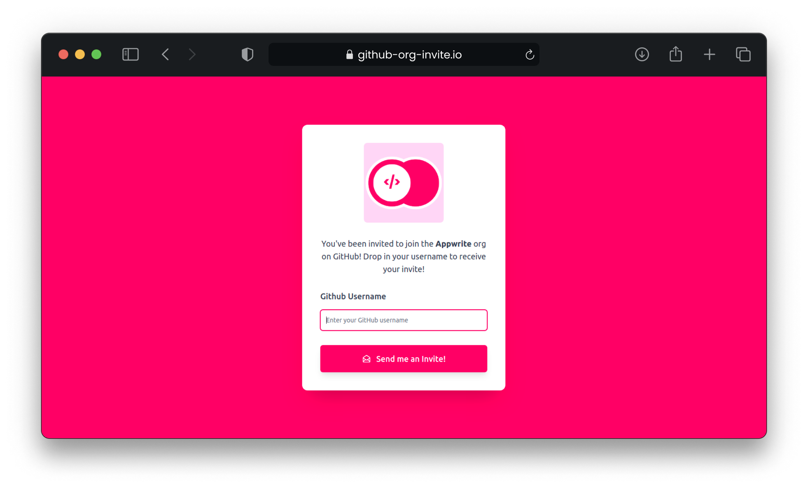

# 📧 GitHub Organization Invite

  

<p align="center">
  
</p>

### A simple web app to easily **invite users to your GitHub Organization**! Built with **Nuxt + Talwind + ❤️**

## 🎯 Features

- Customizable **Background** and **Accent** Colors
- Optionally invite users to **teams**
- **One Click deploy** to Heroku
- **Lightweight** and **fast ⚡️**
- **Nuxt + Tailwind**
- [WIP] **Discord** org validation

## 💫 Get Started

Getting started is extremely easy with the **One Click Deploy to Heroku** Button. You can simply click it and follow the on screen instructions. You can also customize the project with these handy environment variables.

| Name                | Description                                                         | Required |
| ------------------- | ------------------------------------------------------------------- | -------- |
| GITHUB_ACCESS_TOKEN | Your GitHub Access Token                                            | Yes      |
| ORG_NAME            | The organization you wish to invite users to                        | Yes      |
| BASE_URL            | The URL of your hosted app. Eg: https://invite-to-org.herokuapp.com | Yes      |
| TEAM_NAME           | The team in the organization that you wish to invite users to       | No       |
| BACKGROUND_COLOR    | The Background color you wish to use                                | No       |
| ACCENT_COLOR        | The Accent color you wish to use                                    | No       |

If you wish to run this project on your own servers, you can use the following commands.

```sh
$ npm run build
$ npm start
```

## 🧑‍💻 Development

This project is built with **Nuxt SSR**. All the API calls to the GitHub API are made on the server side and all sensitive information is stored on the server side as env variables. You can find the server side code in the `/api` folder.

To run this project locally, you can follow these simple steps
```sh
$ git clone git@github.com:christyjacob4/github-org-invite.git
$ cd github-org-invite
$ cp .env.example .env
```

Fill in the values in the `.env` file.

```sh
GITHUB_ACCESS_TOKEN=
ORG_NAME=
BASE_URL=
TEAM_NAME=
BACKGROUND_COLOR=
ACCENT_COLOR=
```

Once these values have been filled, you can run and visit [http://localhost:3000](http://localhost:3000)

```sh
$ npm install
$ npm run dev
```

## 🤝 Credits

Special thanks to [_thundergolfer_](https://github.com/thundergolfer/automated-github-organization-invites) for setting the foundation for this project.
